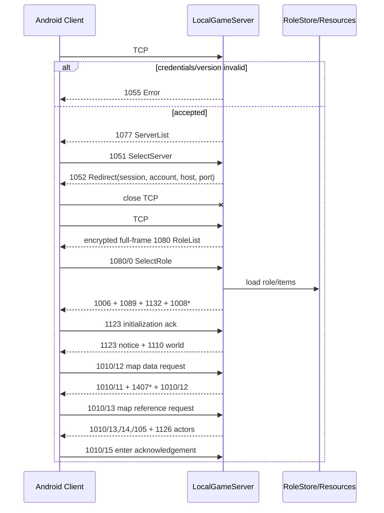
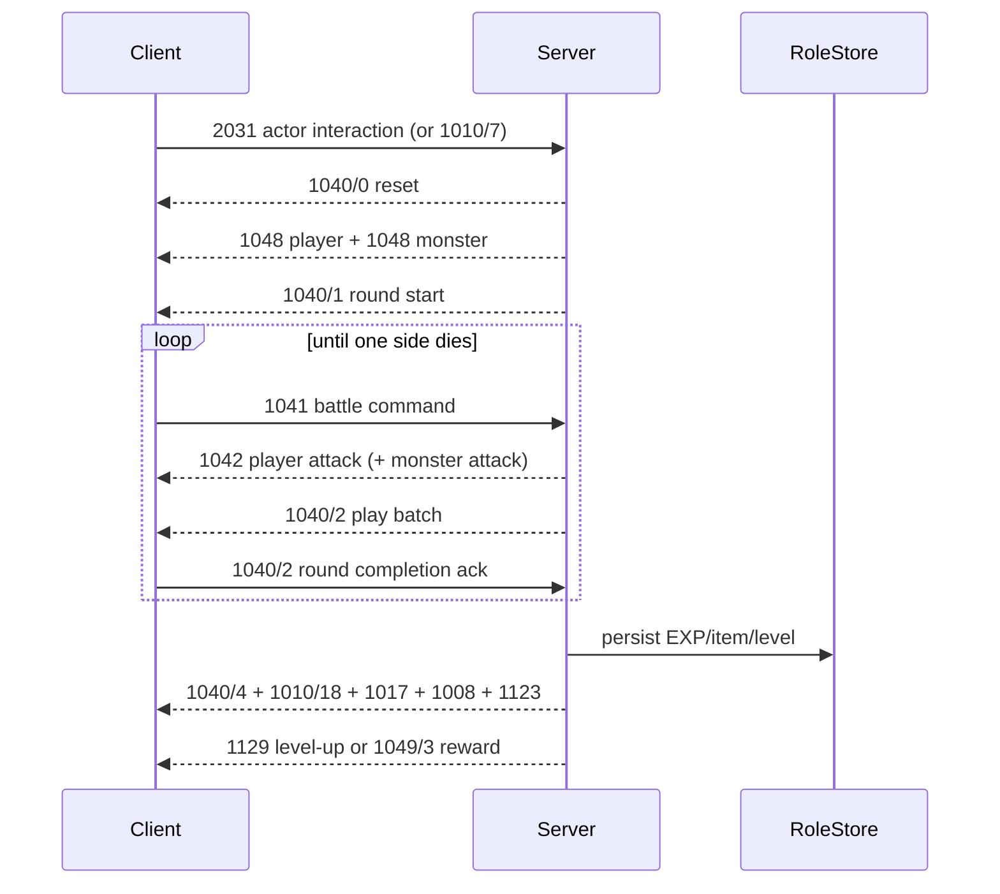

# 协议生命周期时序图

```mermaid
sequenceDiagram
    participant C as Android Client
    participant S as LocalGameServer
    participant D as RoleStore/Resources
    C->>S: TCP #1 + 1077 Login
    alt credentials/version invalid
        S-->>C: 1055 Error
    else accepted
        S-->>C: 1077 ServerList
        C->>S: 1051 SelectServer
        S-->>C: 1052 Redirect(session, account, host, port)
        C-xS: close TCP #1
        C->>S: TCP #2 + encrypted-fields 1052 handshake
        S-->>C: encrypted full-frame 1080 RoleList
        C->>S: 1080/0 SelectRole
        S->>D: load role/items
        S-->>C: 1006 + 1089 + 1132 + 1008*
        C->>S: 1123 initialization ack
        S-->>C: 1123 notice + 1110 world
        C->>S: 1010/12 map data request
        S-->>C: 1010/11 + 1407* + 1010/12
        C->>S: 1010/13 map reference request
        S-->>C: 1010/13,/14,/105 + 1126 actors
        C->>S: 1010/15 enter acknowledgement
    end
```

```mermaid
sequenceDiagram
    participant C as Client
    participant S as Server
    participant D as RoleStore
    C->>S: 2031 actor interaction (or 1010/7)
    S-->>C: 1040/0 reset
    S-->>C: 1048 player + 1048 monster
    S-->>C: 1040/1 round start
    loop until one side dies
        C->>S: 1041 battle command
        S-->>C: 1042 player attack (+ monster attack)
        S-->>C: 1040/2 play batch
        C->>S: 1040/2 round completion ack
    end
    S->>D: persist EXP/item/level
    S-->>C: 1040/4 + 1010/18 + 1017 + 1008 + 1123
    S-->>C: 1129 level-up or 1049/3 reward
```

依据：`server.py:1899-2175`、`test_client.py:50-350`。
